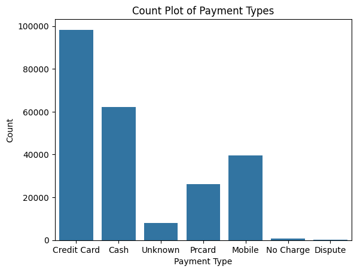
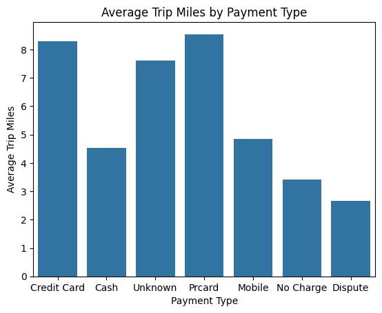
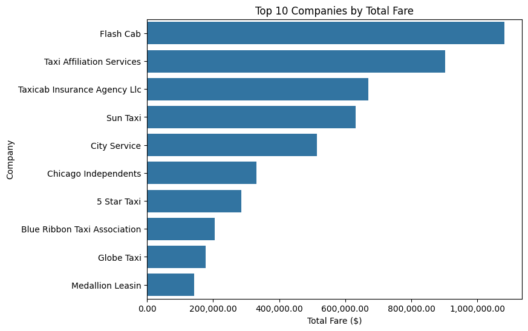
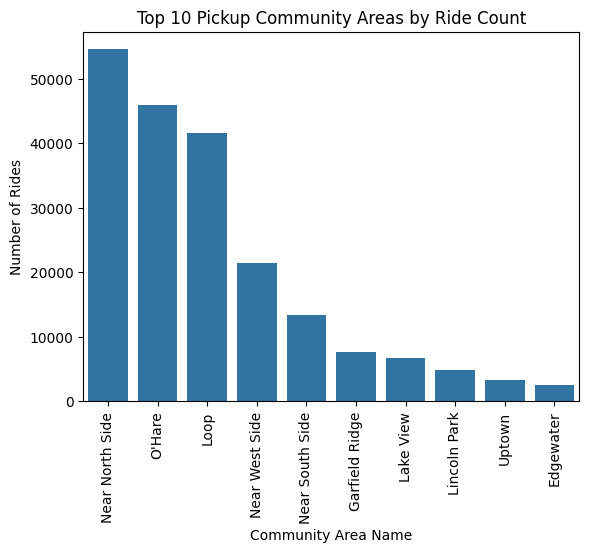
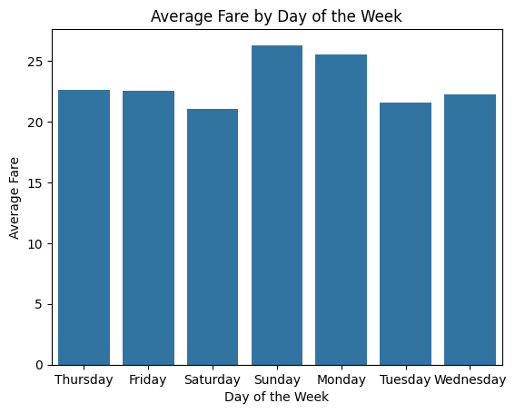

# Cubix Data Engineer Live

## 🌍 Language / Nyelv kiválasztása

- [English](#🇬🇧-english-version)
- [Magyar](#🇭🇺-magyar-verzió)

---

## 🇬🇧 English Version

### Project Description
**Cubix Data Engineer Live** is a sample project created as part of my Data Engineer training. The goal of the project is to retrieve and process daily updated data from the **Chicago Taxi Trips** database and perform the necessary transformations based on the given tasks.

### Features
- Daily data retrieval from the Chicago Taxi Trips database
- Data processing and transformation
- Creation of visualizations for data analysis

### Target Audience
This project serves as a portfolio piece, which can be used in job interviews to demonstrate my skills in data engineering tasks.

### Visualizations
At the end of the project, five different visualizations were created to showcase the results of the data analysis. Below are the visualizations:

### Usage
The project code is available for viewing and study. It is not intended for installation or production use, but rather for demonstrating the transparency of the code.

### File Structure
- **data/**: This folder contains subfolders, which are:
      **csv/** : Contains the CSV files used in the project
      **json_handling/** : Contains spotify_playlist.json, used in a practice task
      **visualizations/** : Contains images of the visualizations
- **src/notebooks** : Contains the project notebooks
- **README.md** : Documentation

### Author
The project was created by: *- Schlachter Martin -*  
Data Engineer Student

---

## 🇭🇺 Magyar verzió

### Projekt Leírása
**Cubix Data Engineer Live** egy példa projekt, amelyet a data engineer képzésem keretében készítettem. A projekt célja a **Chicago Taxi Trips** adatbázis napi frissítésű adatainak lekérése, feldolgozása és a megadott feladatoknak megfelelő transzformációk elvégzése.

### Funkciók
- Napi adatlekérés a Chicago Taxi Trips adatbázisból
- Adatfeldolgozás és transzformáció
- Visualizációk készítése az adatok elemzéséhez

### Célközönség
Ez a projekt bemutatóként szolgál, például állásinterjúkon, hogy demonstrálja a data engineer feladatokhoz szükséges képességeimet.

### Visualizációk
A projekt végén öt különböző vizualizáció készült, amelyek bemutatják az adatok elemzésének eredményeit. Az alábbiakban a ezeket láthatod:

### Használat
A projekt kódja megtekinthető és tanulmányozható. Ez nem telepítésre vagy éles használatra készült, hanem a kód átlátható bemutatását célozza.

### Fájlstruktúra
- **data/**: A mappa további mapákat tartalmaz, melyek a következők:
      **csv/** : A projektben használt CSV fájlokat tartalmazza
      **json_handling/** : Tartalmazza a spotify_playlist.json fájlt, amelyet egy gyakorló feladatban használtam
      **visualizations/** : A vizualizációk képeit tartalmazza
- **src/notebooks** : A projekt notebookjai vannak benne
- **README.md** : Dokumentáció

### Készítő
A projektet készítette: *- Schlachter Martin -*  
Data Engineer Tanuló
